  

  
  
  
  
  
  
  

# 📊 Awesome Insurance Rating Engine

### 🚀 Top Insurance Rating Engine & Pricing Ecosystem

**Curated List of SaaS Platforms & Open-Source GitHub Projects** 🌟  
*Focused on Premium Calculation, Rate Modeling, Tariff Construction, Actuarial Pricing & Rating Automation* 📈  
**Last updated: September 2026** 📅

This repository tracks notable **SaaS platforms** ☁️ and **open-source projects** 💻 for **Insurance Rating Engines**, **Insurance Pricing Systems**, and **Actuarial Rate Calculations**. These tools empower insurers, MGAs, insurtech startups, and actuaries to calculate insurance premiums, build rating models, construct tariff classes, and deploy rate rules into production core policy administration systems. ⚡

---

## 📑 Table of Contents

- [📊 Market Landscape & Sector Analysis](#-market-landscape--sector-analysis)
- [☁️ SaaS / Hosted Insurance Rating Platforms](#%EF%B8%8F-saas--hosted-insurance-rating-platforms)
- [💻 Open-Source GitHub Projects & Rating Tools](#-open-source-github-projects--rating-tools)
- [🤝 Support & Sponsorship](#-support--sponsorship)
- [🤝 How to Contribute](#-how-to-contribute)
- [⚠️ Disclaimer](#%EF%B8%8F-disclaimer)
- [📈 Star History](#-star-history)

---

## 📊 Market Landscape & Sector Analysis

> [!NOTE]
> 📈 **Market Size & Structure**: The global **Insurance Rating Engine & Pricing Software Market** is estimated at **$48.77 Billion in 2025** (projected to reach **$154.08 Billion by 2035** at a **12.19% CAGR**). The sector is **moderately fragmented**—dominated at the enterprise core level by legacy policy suites (Guidewire, Duck Creek), while experiencing rapid unbundling by specialized AI pricing startups (Akur8, Earnix) and niche open-source rating libraries.

---

## ☁️ SaaS / Hosted Insurance Rating Platforms

Below is a comparison of leading enterprise SaaS insurance rating engines, sorted by **Company Size (Revenue / Valuation)** descending. 🏢

| Product Name | Company Size (Revenue / Valuation) | Pricing Tier / Model | Free Tier & Free Trial Limits | Key Features & Rating Description |
| :--- | :--- | :--- | :--- | :--- |
| **[Oracle Health Insurance Rating](https://www.oracle.com/)** | **~$440B Valuation** ($67.36B Revenue) | Custom enterprise license based on covered lives & DWP volume | No free tier; 30-day Free Trial available via Oracle Cloud Free Tier with $300 in free cloud credits | Rating component within Oracle Health & Life suite. High-performance premium calculation engine for group health and life insurance. |
| **[Guidewire Rating](https://www.guidewire.com/)** | **$12.35B Market Cap** ($1.48B Revenue) | Enterprise subscription scaled by Direct Written Premium (DWP) | No free tier; custom proof-of-concept sandbox available upon enterprise request | Rating management component within Guidewire InsuranceSuite & PricingCenter. Manages rate tables, complex rating formulas, and ISO content integration. |
| **[Duck Creek Rating](https://www.duckcreek.com/)** | **$2.60B Valuation** (~$400M ARR) | Annual enterprise SaaS contract based on lines of business & volume | No free tier; custom demonstration environment provided during sales evaluation | Rating module within Duck Creek suite for P&C insurers. Provides rating calculations, actuarial rules, and automated rating workflow logic. |
| **[Sapiens Rating](https://sapiens.com/)** | **~$2.00B Valuation** ($576M Revenue) | Annual SaaS license based on policy volume & module selection | No free tier; guided pilot environment available upon enterprise inquiry | Rating solution within Sapiens IDITSuite. Features Earnix Price-It integration for bi-directional real-time rate execution. |
| **[Majesco Rating](https://majesco.com/)** | **$729M+ Valuation** ($300M Revenue) | Tiered cloud subscription based on Direct Written Premium (DWP) | No free tier; 14-day evaluation sandbox for prospective insurance carriers | Enterprise rating management for P&C and Life/Annuity lines. Supports real-time quote, rate, and issue workflows across broad ISO/NCCI content. |
| **[Insurity Rating](https://insurity.com/)** | **~$500M Valuation** ($330M Revenue) | Enterprise subscription based on premium volume & API calls | No free tier; tailored product demo walkthrough available upon request | Cloud-based rating engine for commercial P&C. Features Ratio Content Engine for automated ISO, NCCI, and AAIS bureau content ingestion. |
| **[Akur8](https://www.akur8.com/)** | **$432M Valuation** ($62M ARR) | Annual SaaS subscription tiered by actuarial user seats & modules | No free tier; **14-day free pilot program** using carrier's own historical data with actuarial scientist support | Global Actuarial AI Platform for transparent P&C and L&A rate modeling. Automates risk and demand modeling while maintaining full regulatory explainability. |
| **[Earnix](https://earnix.com/)** | **$1.00B+ Valuation** ($100M Revenue) | Custom enterprise pricing based on DWP and deployed rate engines | No free tier; structured 30-day proof-of-concept (PoC) pilot for enterprise carriers | AI-driven SaaS platform for pricing, rating, and personalization. Earnix Price-It provides high-speed cloud-native rating logic. |
| **[EIS Rating](https://eisgroup.com/)** | **~$300M Valuation** ($150M Revenue) | SaaS subscription based on active policy count & carrier DWP | No free tier; customized demo sandbox environment provided upon request | Core rating engine within EIS Suite. Cloud-native, API-first architecture for multi-line P&C, life, and health insurance rating. |
| **[OneShield Rating](https://oneshield.com/)** | **~$250M Valuation** ($93M Revenue) | Subscription licensing based on transaction volume & lines of business | No free tier; guided interactive sandbox walkthrough available upon inquiry | Configurable rating engine integrated into OneShield Enterprise. Supports real-time premium calculations and complex rating matrices. |
| **[INSTANDA](https://instanda.com/)** | **~$150M Valuation** ($46.5M Revenue) | Tiered SaaS pricing based on active insurance products & GWP | No free tier; 30-day trial sandbox provided during guided onboarding | No-code insurance product builder with built-in rating engine and underwriting rules. Enables rapid product deployment without IT cycles. |

---

## 💻 Open-Source GitHub Projects & Rating Tools

Below is a curated list of active open-source insurance rating engines, actuarial libraries, and tariff construction tools, sorted by **GitHub_Stars** descending. ⭐

| Project Name | GitHub_Stars | Language / Ecosystem | Description & Actuarial Use Case |
| :--- | :---: | :--- | :--- |
| **[mharinga/insurancerating](https://github.com/mharinga/insurancerating)** |  | R 📦 | Premier R package for actuarial risk classification and tariff construction. Features GAM risk modeling, evolutionary tree binning, and GLM tariff class generation. |
| **[MindSetLib/Insolver](https://github.com/MindSetLib/Insolver)** |  | Python 🐍 | Low-code machine learning framework for insurance pricing, reserving, and risk modeling. Designed for production deployment with PyTorch and Scikit-Learn. |
| **[nemmons/aspire](https://github.com/nemmons/aspire)** |  | Python 🐍 | Flexible Python-based insurance rating engine for defining custom rating algorithms, factor tables, and premium calculation workflows. |
| **[gs-actuary/ratingtables](https://github.com/gs-actuary/ratingtables)** |  | R 📦 | Table-driven insurance rating engine for R. Executes ordered rating specifications, supports caps, rounding, coverage plans, and complete audit tracing. |
| **[Burning Cost](https://github.com/burningcost/shap-relativities)** |  | Python 🐍 | Suite of open-source Python tools for personal lines pricing. Converts GBM models (CatBoost/XGBoost) into GLM-compatible multiplicative rating factor tables via SHAP. |
| **[WattyAI/actuaflow](https://github.com/WattyAI/actuaflow)** |  | Python 🐍 | End-to-end Python framework for actuarial pricing, implementing frequency-severity GLM modeling and automated tariff class generation. |
| **[imanebosch/acturate](https://github.com/imanebosch/acturate)** |  | Python 🐍 | Lightweight open-source actuarial rating engine for executing custom rating formulas and actuarial factor table lookups. |
| **[ACTUS Insurance Core](https://github.com/actusfrf/actus-solidity)** |  | .NET / C# 🔷 | Algorithmic Contract Types Unified Standards (ACTUS) engine implementation for insurance contract modeling, premium payment schedules, and state transitions. |
| **[Premium Calculation Engine](https://github.com/topics/insurance-rating)** |  | .NET / C# 🔷 | Modular .NET framework supporting defined-benefit, defined-contribution, and multi-factor rating algorithms for life and health insurance products. |

---

## 💖 Support & Sponsorship

Thank you for visiting this repository! If you found this list helpful, please consider starring ⭐, forking 🍴, or sharing 📢 it with fellow actuaries, developers, and pricing teams.

If you'd like to support ongoing maintenance and research, you can buy me a coffee via the [GitHub Sponsor Dashboard](https://github.com/sponsors/ishandutta2007). ☕

---

## 🤝 How to Contribute

1. Fork this repository. 🍴
2. Update or add entries to `README.md` keeping formatting consistent with existing tables. 📝
3. Ensure SaaS entries include verified starting pricing and free tier/trial details. 🏷️
4. For Open-Source entries, include the repository link, Stars_Badge linking to `/stargazers`, language, and clear actuarial description. 📌
5. Submit a Pull Request with a short summary of changes. 🚀

---

## ⚠️ Disclaimer

- This list is **community-curated** for research and architectural evaluation. 💡
- Insurance rating engines execute regulated financial calculations; ensure compliance with local actuarial governance (CAS/SOA), regulatory filings, and auditing standards. ⚖️

---

## 📈 Star History

---

**Maintained for Actuaries, Pricing Analysts, Insurtech Builders, and Insurance Software Engineers.** 🚀
